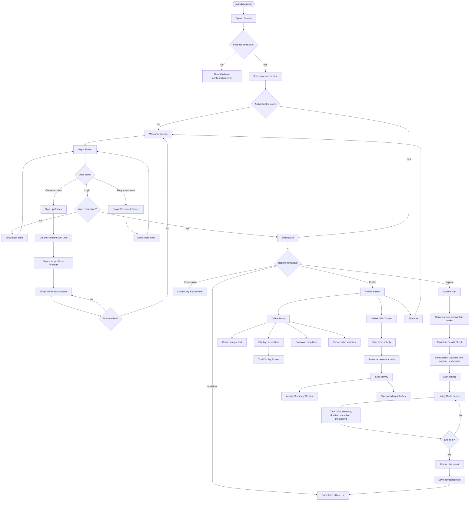
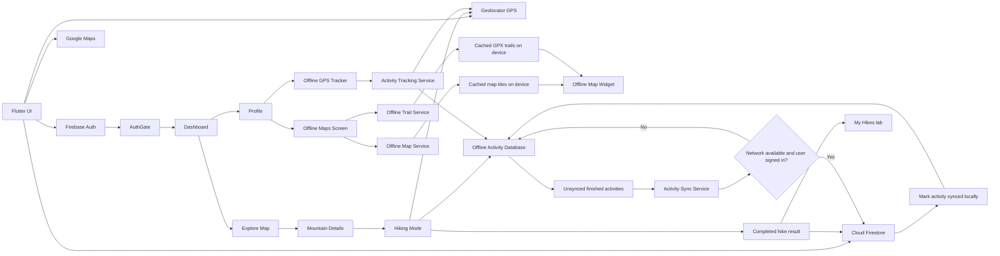

# Agakbay App Flowchart

This flowchart summarizes the current Flutter app flow from startup through authentication, dashboard navigation, hiking, offline maps, and offline activity sync.

## Main User Flow

## Offline And Data Flow

## Key App Areas

- Startup: `SplashScreen` initializes Firebase and starts `ActivitySyncService`.
- Auth: `AuthGate`, `WelcomeScreen`, `LoginScreen`, `SignUpScreen`, `ForgotPasswordScreen`, and `EmailVerificationScreen`.
- Dashboard: `Explore`, `My Hikes`, `Community`, and `Profile` tabs.
- Hiking: mountain details open `_HikingModeScreen`, which returns a completed hike result to the dashboard.
- Offline maps: `OfflineMapExampleScreen`, `OfflineMapService`, `OfflineTrailService`, and `OfflineMapWidget`.
- Offline tracking: `OfflineActivityTrackerScreen`, `ActivityTrackingService`, `OfflineActivityDatabase`, and `ActivitySyncService`.
