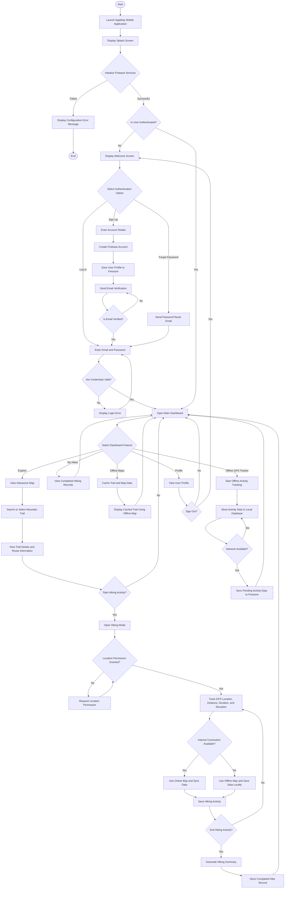

# Capstone Flowchart: Agakbay Hiking Application

## General System Flowchart

## Figure Description

The flowchart presents the general process of the Agakbay mobile hiking application. The system begins by launching the application and initializing Firebase services. If initialization succeeds, the application checks whether the user is already authenticated. New users may create an account, verify their email, or reset their password, while existing users may proceed directly to the main dashboard.

From the dashboard, users can access the major features of the application: exploring mountain trails, starting a hiking activity, viewing completed hikes, using offline maps, tracking offline GPS activities, and managing their profile. During hiking, the application requests location permission, records GPS-based activity data, and determines whether internet connectivity is available. If the device is offline, activity data is stored locally and synced to Firestore once a network connection becomes available.

## Short Caption For Paper

**Figure X. General system flowchart of the Agakbay hiking application showing user authentication, trail exploration, hiking activity tracking, offline storage, and cloud synchronization.**
